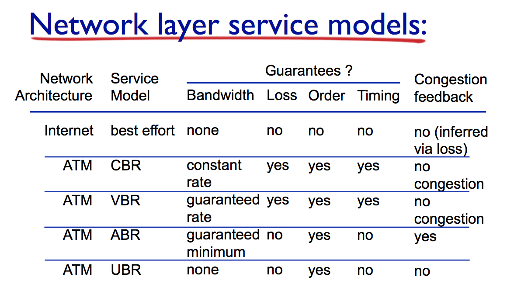

# Network Layer

	Sources: 
	[1] My Prof. Slides at University of Tehran
	

## Material
<ol>
	<li>Data Plane
		<ul>
			<li>Network Layer
				<ul>
					<li>transport segment from sending to recieving host</li>
					<li>
						encapsulates segment into datagram
					</li>
					<li>
						it is in both hosts and routers
					</li>
					<li>
						routers examine header fields in IP datagrams
					</li>
				</ul>
			</li>
			<li>Network-layer Functions
				<ul>
					<li>Forwarding: move pachet from router input to output</li>
					<li>Routing: determine route taken from source to destination</li>
				</ul>
			</li>
			<li>Data Plane 
				<ul>
					<li>local, per-router function</li>
					<li>forwarding</li>
				</ul>
			</li>
			<li>Network Architecture
				
			</li>
		</ul>
	</li>
	<li>Control Plane
		<ul>
			<li>Control Plane
				<ul>
					<li>network wide</li>
					<li>approaches
						<ul>
							<li>
								traditional routing algorithm : implemented in router
							</li>
							<li>
								software defined networking: implemented in servers (remote)
							</li>
						</ul>
					</li>
				</ul>
			</li>
		</ul>
	</li>
</ol>

